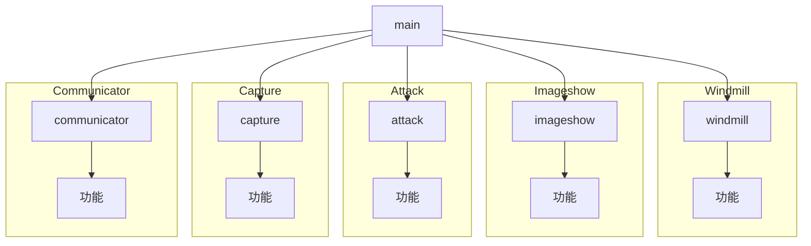
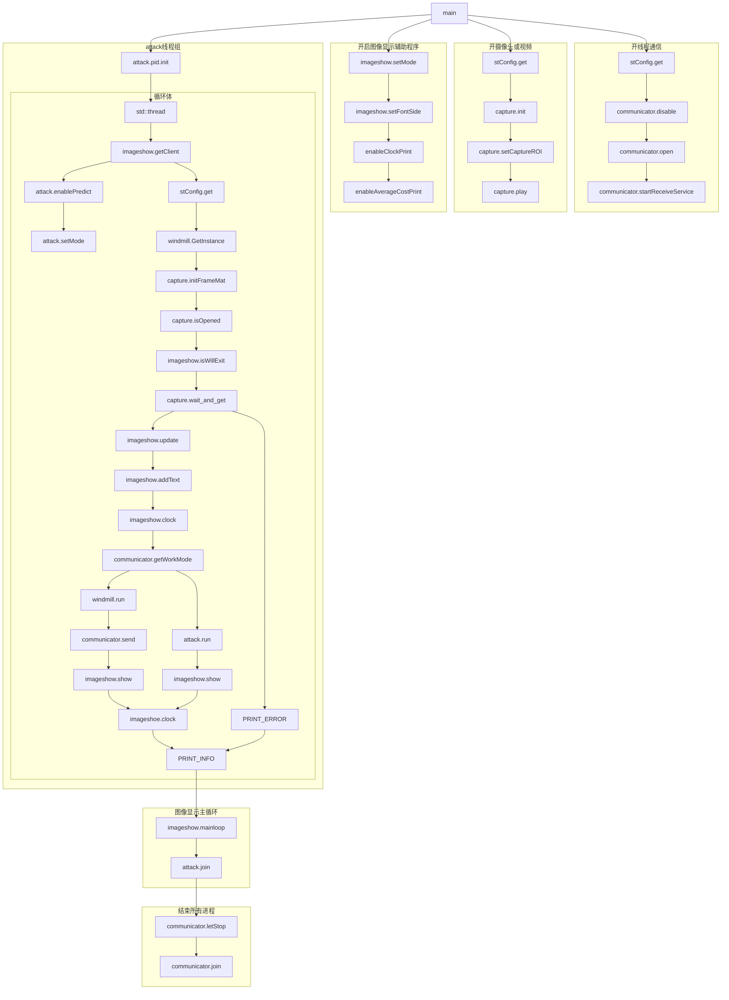

# 老代码阅读报告

## 一.程序的功能框图

### 

1.1 Communicator功能

- 开线程
- 打开设备，守护进程
- 接收线程
- 获得当前工作模式：摸鱼，自瞄，大风车
- 将获得的云台全局欧拉角发送给电控
- 结束所有线程

1.2 Capture功能

- 打开视频或摄像头
- 初始化摄像头
- 开启ROI并开始采集
- 采集并传输图像
- 初始化图像数据结构
- 查询是否打开摄像头
- 阻塞获取摄像头
- 获得当前“阻塞获取摄像头”获得图像的时间间隔

1.3 Attack功能

- 初始化Attack类的对象
- 设置是否开预测
- 设置起始击打颜色为红色
- 实现完整的自瞄过程
  - 初始化参数，判断是否启用ROI
  - 预检测
  - 使用分类器筛去错误图像
  - 处理多线程新旧数据处理的问题
  - 获得云台全局欧拉角
  - 进行对需击打目标的匹配
  - 对该目标的位置进行预测并进行坐标修正
  - 修正弹道并计算欧拉角
  - 调整射击策略
  - 通过PID对yaw进行修正
  - 将信息发送给电控

1.4 Imageshow功能

- 设置显示模式和字体
- 设置是否输出clock的计时
- 设置是否输出cpu平均耗时
- 根据设定的线程依次生成客户端
- 判断是否退出图像显示
- 判断窗口是否暂停刷新
- 拷贝传递本次处理的基础图像，将后续绘图都设定为绘制在这张图上
- 在窗口右上角绘制预测目标
- 计算两次相同的实参传入之间的耗时
- 通知服务端刷新图像显示

1.5 Windmill功能

- 风车实例化
- 判断是否有目标
- 根据当前的风车模式，对风车的参数进行初始化
- 判断是否有风车目标
- 进行风车击打

## 二.程序的函数调用图

